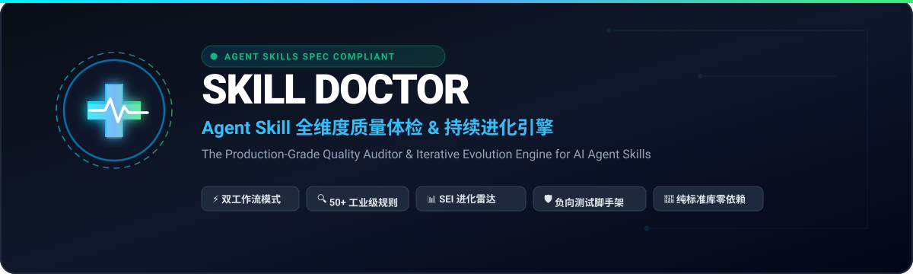

<p align="center">
  
</p>

# 🩺 技能审查师 / Skill Doctor

<div align="center">

**给 AI Agent 技能做全维度深度体检与自进化：四大形态专属引擎、50+ 项工业级规则、SEI 进化度量化评估、多文件脚手架一键注入与自愈修复指引。**

**Industrial-grade AI Agent skill auditor & iterative evolution engine: 4 architectural engines, 50+ static rules, SEI index, multi-file scaffolding, and actionable fix hints.**

[](LICENSE)
[](CHANGELOG.md)
[](SKILL.md)
[-brightgreen)](SKILL.md)
[](https://github.com/hyt315/skill-doctor/stargazers)

[English](./README.en.md) | [中文](./README.md)

</div>

---

## 📖 这是什么？

技能写完了、能跑、Demo 很漂亮——但它真的可靠吗？在真实的 Agent 生态中，开发者常面临这些隐蔽陷阱：
- 代码里用了宽捕获 `except Exception:` 悄悄吞掉了关键报错，导致门禁名义存在、实际静默放行；
- Markdown 里引用的图片、视频或脚本文件在盘缺失，导致用户与 AI 读到断图和死链接；
- 在 Windows 下编写的 Bash 脚本带 `\r`（CRLF）换行，推送到 Linux CI 后直接报 `command not found: set`；
- 脚本中无意内嵌了 Git Remote Token URL（`https://token@github.com`）或个人开发机绝对路径；
- `SKILL.md` 中堆砌了几十处“必须/绝不/一律”，导致模型注意力分散、指令遵循率急剧衰减（IFScale 退化）。

**`skill-doctor`** 是一个专为 AI Agent 技能打造的工业级质量审查元技能与终端审计工具。它确立了 **四大架构形态专属审计引擎**，内置 **50+ 项全维度静态规则**、**动态实跑自测**、**负向破坏用例抽查** 与 **40+ 条真实通病坑库**，并提供 `--json`、`--markdown` 导出与 **Actionable Auto-Fix 自愈建议**，将「看起来能跑」和「真正工业级可靠」之间的差距量化出来。

---

## ✨ 核心特性

| 核心模块 | 覆盖功能与能力 | 带来价值与质量门禁 |
|---|---|---|
| 🤖 **五大形态专属审计引擎** | 智能适配纯提示词型、CLI 脚本增强型、MCP 协议端型、多阶段流水线型与复合型技能 | 告别一刀切，量体裁衣，因材施教，绝不强塞空脚本 |
| 🌐 **四维深水区联网检索矩阵** | 自动提炼技能领域核心词，输出官方规范/RFC、生产级杀手坑、开源标杆与指标基线 4 维检索指令 | 驱动技能从浅层修补跃迁至深水区内容丰满与灵魂注入 |
| 🔍 **50+ 项全维度静态规则** | 覆盖 FM 结构、LK/AS 链接与资产、SF 静默失效、SEC 深度安全、EN/PL 跨平台工程、CK/TC 口径与 Prompt 健康 | 逐项编号可追溯，精准拦截 CRLF、Token URL、连续连字符、宽捕获与断链 |
| 🧬 **技能迭代进化引擎 (`evolve.py`)** | 形态自适应 SEI 指数 (0-100)、演进方案自动生成 (`--plan`)、专属脚手架注入 (`--scaffold-test` / `--scaffold-prompt` / `--scaffold-all`) | 驱动技能从脆弱的单文件或浅层说明升级为工业级 multi-file 系统 |
| 🏃 **动态实跑真实验证** | 实际拉起并运行被审技能的自测脚本（`selftest.py`）或评测集（`evals/`），核验退出码语义诚实度 | 杜绝靠纯文本检查产生的虚假安全感 |
| 🎯 **负向破坏用例抽查** | 针对安全与质量门禁构造破坏样本，验证拦截门是否真的会阻断违规输入 | 专抓「门名义存在、实际放行」的最危险静默失效 |
| 🧠 **50+ 条真实通病坑库** | 从数百次真实技能审查与重构实战中沉淀的典型坑库（现象 → 根因 → 修复 → 预防） | 持续沉淀最佳实践，避免重蹈覆辙 |
| 📄 **多格式导出与自愈建议** | 支持 ANSI 控制台高亮看板、`--json` 机器可读、`--markdown` GitHub 表格导出 | 自带一键修复代码建议，无缝集成 CI 流水线 |
| 🛡️ **纯 Python 零依赖只读** | 仅使用 Python 3.10+ 标准库，审查过程对目标代码 100% 只读，零副作用 | 随处秒开秒跑，无需安装繁琐三方依赖 |

### 🧬 技能进化指数看板 (Skill Evolution Index Radar)

只需一条命令，即可量化技能成熟度，并生成专业进阶方案与全套脚手架：

```text
======================================================================
       skill-doctor 技能进化度评估看板 (Skill Evolution Index)
======================================================================
目标技能: my-agent-skill
综合进化指数 (SEI): 85 / 100
----------------------------------------------------------------------
评估维度                             | 当前得分       | 满分基线      
----------------------------------------------------------------------
Architecture (多文件完备度)         | 20         | 20
Tooling (确定性脚本工具化)           | 20         | 20
FactCard (事实卡与指标基线)         | 20         | 20
Safety (只读优先与写操作授权解耦)   | 15         | 20
Verification (负向破坏与AST语法门禁)| 10         | 20
----------------------------------------------------------------------
```

---

## 📊 技能体检与进化全流程架构

```
[输入: 待审查的 AI 技能目录]
                       │
      [Step 0: 四大技能架构形态精准识别]
      判定: 纯提示词 / CLI 增强 / MCP 协议端 / 多阶段流水线
                       │
      [Step 1: 50+ 项全维度静态规则扫描]
      拦截结构缺陷 / 资产断链 / 宽捕获吞异常 / Token URL 泄露 / CRLF 换行
                       │
      [Step 2: 动态回归实跑 (--dynamic)]
      实际拉起被审技能 selftest，核验真实退出码与通过报告一致性
                       │
      [Step 3: 负向破坏样本抽查]
      构造故意破坏样本，验证质量门是否真能拦截非法输入
                       │
      [Step 4: 50+ 条实战通病坑库逐项核对]
      对照历史高频通病，排查暗环节与状态机落盘缺陷
                       │
      [Step 5: 报告生成与 Actionable 自愈建议]
      输出 audit-report.txt / --json / --markdown，给出分级修复路径
                       │
      [Step 6: SEI 技能进化与脚手架注入 (evolve.py)]
      计算五维成熟度得分，输出 Evolution Plan Markdown 并注入 Multi-File 骨架
```

---

## 🚀 快速开始

这是一个标准的 AI Agent Skill —— 既可装进 AI 助手使用，也可在终端直接当作 CLI 工具运行。

### 方式 A：把一句话发给任意 Agent（最推荐、最通用）

把下面这段话直接复制发送给你的 AI 助手，它会自动完成安装：

> 请安装 skill-doctor 技能：克隆 `https://github.com/hyt315/skill-doctor` 到你的 skills 目录（如 `~/.claude/skills/skill-doctor` 或 `~/.agents/skills/skill-doctor`），并确认安装成功。以后我要「审查/体检技能、上线前质量把关」时，按 SKILL.md 流程执行静态与动态审计。

### 方式 B：GitHub CLI 2.90+（一行命令）

```bash
gh skill install hyt315/skill-doctor skill-doctor --agent claude-code --scope user
```

### 方式 C：多平台手动安装

| 平台 | 用户级安装路径 | 项目级安装路径 |
|---|---|---|
| **Claude Code** | `git clone https://github.com/hyt315/skill-doctor.git ~/.claude/skills/skill-doctor` | `.claude/skills/skill-doctor` |
| **Codex** | `git clone https://github.com/hyt315/skill-doctor.git ~/.agents/skills/skill-doctor` | `.agents/skills/skill-doctor` |
| **Cursor** | `git clone https://github.com/hyt315/skill-doctor.git ~/.cursor/skills/skill-doctor` | `.cursor/skills/skill-doctor` |
| **通用 Agents** | `git clone https://github.com/hyt315/skill-doctor.git ~/.agents/skills/skill-doctor` | `.agents/skills/skill-doctor` |

### 方式 D：本地终端直接当 CLI 运行

```powershell
# 对任意本地技能目录执行静态审查（生成 audit-report.txt）
python scripts/audit.py path/to/your-skill

# 包含动态自测实跑
python scripts/audit.py path/to/your-skill --dynamic

# 输出机器可读 JSON 格式（供 CI 流水线消费）
python scripts/audit.py path/to/your-skill --json

# 输出 GitHub Markdown 表格格式
python scripts/audit.py path/to/your-skill --markdown

# --- 🚀 迭代进化引擎 (Skill Evolution Engine) ---
# 1. 评估技能形态与进化度，计算 SEI (0-100) 并输出雷达分析
python scripts/evolve.py path/to/your-skill --analyze

# 2. 提取该领域核心词，自动生成四维深水区联网检索矩阵 (RFC/踩坑/标杆/基线)
python scripts/evolve.py path/to/your-skill --research-plan

# 3. 自动生成针对该技能的《迭代进阶方案》Markdown (含四维检索与形态工程)
python scripts/evolve.py path/to/your-skill --plan -o evolution-plan.md

# 4. 针对确定性脚本型技能：一键注入标准自测套件 (tests/ 与 scripts/selftest.py，含 AST 校验与 DY002 负向夹具)
python scripts/evolve.py path/to/your-skill --scaffold-test

# 5. 针对纯提示词型技能：一键注入评测用例套件 (evals/trigger_cases.json，含对抗性与边界负向用例)
python scripts/evolve.py path/to/your-skill --scaffold-prompt

# 6. 一键注入完整多文件脚手架 (自测套件 + references/fact-card.md 标准事实卡)
python scripts/evolve.py path/to/your-skill --scaffold-all

# 运行 skill-doctor 自身的回归测试
python scripts/selftest.py
```

---

## 🔒 安全与只读原则

- **严格纯只读**：审查过程只读分析目标技能代码，绝不擅自改动或重写被审项目的任何文件；
- **零网络调用**：所有规则匹配与语法树分析均在本地离线完成，绝不向外上传代码或 Prompt；
- **沙箱化自测**：动态实跑默认仅在传入 `--dynamic` 时显式触发，防止对生产环境产生未预期的副作用。

---

## 📥 下载与获取

| 方式 | 命令 / 链接 |
|---|---|
| **HTTPS** | `git clone https://github.com/hyt315/skill-doctor.git` |
| **SSH** | `git clone git@github.com:hyt315/skill-doctor.git` |
| **GitHub CLI** | `gh repo clone hyt315/skill-doctor` |
| **ZIP 压缩包** | [下载 ZIP](https://github.com/hyt315/skill-doctor/archive/refs/heads/main.zip) |
| **Tar 归档** | [下载 Tar](https://github.com/hyt315/skill-doctor/archive/refs/heads/main.tar.gz) |
| **单文件 (SKILL.md)** | `curl -O https://raw.githubusercontent.com/hyt315/skill-doctor/main/SKILL.md` |

---

## 📖 深度参考手册导读

| 参考文档 | 核心内容 | 推荐阅读时机 | 预估耗时 |
|---|---|---|---|
| 📋 [**静态规则清单 (`静态规则清单.md`)**](references/静态规则清单.md) | 50+ 项工业级规则定义、编号出处与分级修复建议 | 审查报错排查与规则对齐时 | 4 分钟 |
| 🛡️ [**通病坑库 (`坑库.md`)**](references/坑库.md) | 50+ 条真实开发踩坑沉淀（现象 → 根因 → 修复 → 预防） | 审查复杂技能与排查隐蔽缺陷时 | 5 分钟 |
| 🩺 [**审查与进化方法论 (`审查与进化方法论.md`)**](references/审查与进化方法论.md) | 五大形态自适应判定、负向夹具、安全治疗、五阶段进化范式与 SEI 模型 | 编写自测、全身体检与技能迭代升级时 | 5 分钟 |

---

## 📁 文件结构

```
skill-doctor/
├── SKILL.md                          # 核心技能定义、双模式工作流（审查体检 + 迭代进化）
├── README.md                         # 中文说明文档
├── README.en.md                      # 英文说明文档
├── CHANGELOG.md                      # 版本发布记录
├── LICENSE                           # MIT 开源许可证
├── .gitignore                        # Git 忽略规则
├── CONTRIBUTING.md                   # 社区贡献指南
├── CODE_OF_CONDUCT.md                # 行为准则
├── SECURITY.md                       # 安全策略
├── SUPPORT.md                        # 支持渠道
├── manifest.json                     # 技能元数据清单
├── agents/                           # 多 Agent 平台元数据
├── assets/                           # 视觉资产
│   └── banner.svg                    # 专属高清矢量 Hero Banner
├── evals/                            # 触发用例评测集
├── tests/                            # 单元测试与 AST 语法树自校验
│   └── test_skill.py                 # 标准单元测试入口（含 AST 语法完整性断言）
├── scripts/
│   ├── audit.py                      # 核心审计引擎（四大形态 + 50+规则 + 多格式导出）
│   ├── evolve.py                     # 迭代进化引擎（SEI五维评估 + 方案生成 + 脚手架注入）
│   ├── trigger_eval.py               # 触发边界评测脚本
│   └── selftest.py                   # 自动化回归自测脚本（28 项全面回归）
└── references/                       # 规则清单、通病坑库与方法论
    ├── 静态规则清单.md                # 50+ 项工业级规则全览
    ├── 坑库.md                        # 50+ 条真实踩坑与避坑对策（含坑 44-52）
    └── 审查与进化方法论.md            # 五大形态、负向夹具、安全治疗与五阶段进化范式
```

---

---

## 🌐 GitHub 开源全生命周期协作矩阵 (Open Source Lifecycle Suite)

面向独立开发者与开源团队的完整工具链闭环：

| 阶段 / 角色 | 推荐技能 | 核心使命与能力 | GitHub 仓库 |
|---|---|---|---|
| 📦 **开源前准备** | [**`github-oss-prep`**](https://github.com/hyt315/github-oss-prep) | 自动化生成规范门面、中英双语 README、CI 工作流、社区资产与合规审计 | [hyt315/github-oss-prep](https://github.com/hyt315/github-oss-prep) |
| 🩺 **质量体检** | [**`skill-doctor`**](https://github.com/hyt315/skill-doctor) | 50+ 项工业级静态规则 + 动态实跑自测，确保 Agent Skill 100% 满分无死角 | [hyt315/skill-doctor](https://github.com/hyt315/skill-doctor) |
| ⚙️ **开源后运营** | [**`github-oss-ops`**](https://github.com/hyt315/github-oss-ops) | 智能分流 Issue、AI 垃圾防御、PR 辅助审查、GHSA 私有漏洞协同与发版全渠道广播 | [hyt315/github-oss-ops](https://github.com/hyt315/github-oss-ops) |
| 🚀 **贡献者导航** | [**`github-oss-contribute`**](https://github.com/hyt315/github-oss-contribute) | 面向贡献者的全程向导：Fork 同步、Rebase 冲突消解、DCO 签名、反 AI Slop 质量门禁 | [hyt315/github-oss-contribute](https://github.com/hyt315/github-oss-contribute) |

---

## ❓ 常见问题 (FAQ)

- **Q: 什么是「门名义存在实际放行」？**  
  A: 指测试代码中虽然写了 `try...except` 或 `if` 门禁，但由于异常被静默吞掉或返回值未断言，导致即使出现重大错误测试依然退出 0 绿标通过。
- **Q: 审查工具需要安装第三方 Python 依赖吗？**  
  A: 完全不需要。基于 Python 3.10+ 原生标准库开发，纯净零依赖，任何机器克隆即可运行。
- **Q: 报告中的 WARN 和 FAIL 有什么区别？**  
  A: FAIL 代表阻断性的硬缺陷（如硬编码密钥、Git Token 泄露、CRLF 导致 CI 崩溃、虚假退出码）；WARN 代表设计层面的优化建议（如引用层级过深、Token 偏多、缺少强读取时机）。

---

## 🤝 参与贡献

欢迎提交 Issue 与 Pull Request！详见 [CONTRIBUTING.md](CONTRIBUTING.md)。如果这个技能对你有帮助，欢迎在 GitHub 上点个 [Star ⭐](https://github.com/hyt315/skill-doctor/stargazers)！

---

## 📄 开源协议

本项目采用 [MIT 许可证](LICENSE) 开源。

---

> 🌏 **English: [README.en.md](./README.en.md)**
